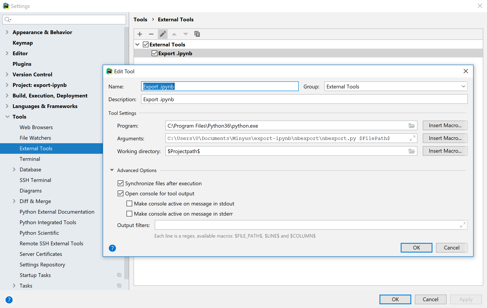

# nbexport, Python code to export .ipynb file from .py

Python code: https://github.com/Minyus/export-ipynb/blob/master/nbexport/nbexport.py

This is a Python code to export .ipynb file from .py using `#%%` as the separator of cells so your Python code can be run in Jupyter or Google Colab (with GPU) keeping the code chunks separated as cells.

This Python code is especially useful for Pythonistas who use PyCharm Professional's Scientific Mode to develop a Deep Learning code and Google Colab to run with GPU.

## Instruction to use as an external tool in PyCharm

Navigate to `File` >> `Settings` >> `Tools` >> `External Tools` >> `+` icon, and configure as shown in the following screenshot.

	Set up in PyCharm External Tools

To use, right-click the .py file >> External Tools >> "Export .ipynb" as shown in the following screenshot.

 

	Use as a PyCharm External Tool

Reference: https://www.jetbrains.com/help/pycharm/settings-tools-external-tools.html

## Dependencies
- nbformat
- argparse
- pathlib (available in Python 3.4 and higher)

## Related tools

- [PyCharm Professional: Scientific Tools](https://www.jetbrains.com/pycharm/features/scientific_tools.html)
- [PyCharm Professional: Running and Debugging Jupyter Notebook Cells](https://www.jetbrains.com/help/pycharm/running-jupyter-notebook-cells.html)
- [Jupytext](https://github.com/mwouts/jupytext)
